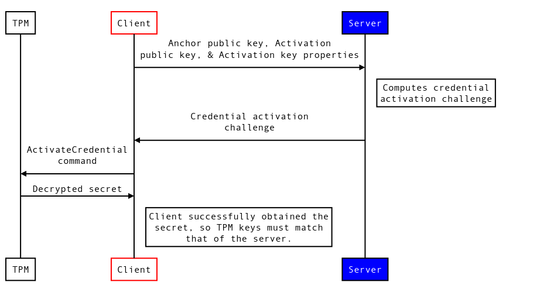

# Credential Activation

Credential activation remotely proves a specific attestation key resides on
the same TPM as a specific endorsement key. Because the endorsement key is the
cryptographic identifier for a TPM (and by extension, the device), credential
activation enables a remote system to establish trust in a new key, which can
then be used to encrypt or attest on behalf of the device.

Credential Activation is a poorly documented TPM concept. This document
aims to explain how it works and what it is used for, without assuming any
knowledge of the TCG specifications.

## Overview

Abstractly: credential activation allows a remote party to verify one key is
on the same TPM as another key, and that the key has a specific set of
properties.

The description in the first paragraph describes the activation of an
attestation key with the endorsement key. While this is the most common use
of credential activation, any two asymmetric key-pairs in the TPM can be
used.

### How it works

The credential activation procedure involves the remote end generating a
specially-crafted, encrypted challenge for the TPM to process. The server
generates this challenge based on knowledge of two TPM keys (specifically,
their public keys and key properties), and the secret data it wishes to
encrypt.

This challenge can be decrypted by the TPM using the `ActivateCredential`
command. Through this command, the user presents to the TPM:

 * The encrypted challenge generated by the server
 * A handle to the 1st key
 * A handle to the 2nd key

If the keys and their properties are present on the TPM, and match exactly
the keys the server used to generate the challenge, the TPM will decrypt
the secret contained within, and return it as the response to the command.

## Why use credential activation?

**TL;DR: Credential activation lets you trust a new key.**

While devices are typically identified by the endorsement key burned into
their TPM, key usage restrictions set on most endorsement keys mean they
typically cannot be used for signing or attestation. As such a different
key is needed.

After the new key is generated on the TPM, the credential activation
procedure allows you to prove that:

 * The new key has acceptable properties (ie: A key intended for attestation
   can only be used in attestation commands, and the key material cannot be
   exported).
 * The new key is present & on the same TPM as an endorsement key.

Once credential activation completes successfully, the remote end can be
sure of the properties of the key & which device it was generated for, and
start trusting the use of the new key on behalf of the device.

## Detailed process

### Glossary

**Activation key** - The first public key. Credential activation verifies that
this key is resident on the TPM, *and it has a specific set of properties.*

**Anchor key** - The second public key. Credential activation verifies this
key is resident on the same TPM as the activation key.

### Sequence of operations

1. The Client device informs the server of the public keys of both the anchor
   and activation key, as well as communicating the key properties of the
   activation key.

2. The server computes the activation challenge, as described below. This
   challenge is sent back to the client.

3. The Client invokes the `ActivateCredential` command, providing the encrypted
   challenge from the server, and handles to the two keys.

4. If the keys handles presented have public keys / properties matching those
   the server used when computing the challenge, the TPM will be able to
   decrypt and return the secret.

## Appendix: Generating the credential activation challenge

TODO
